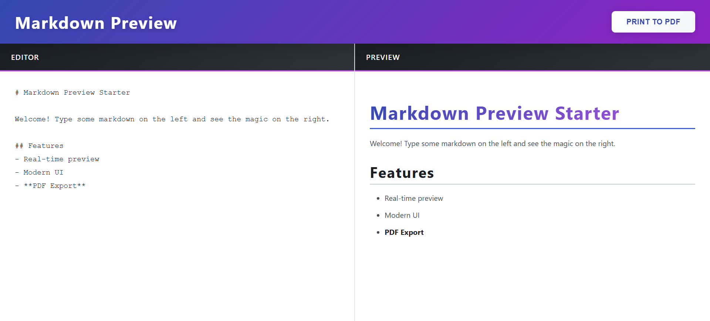
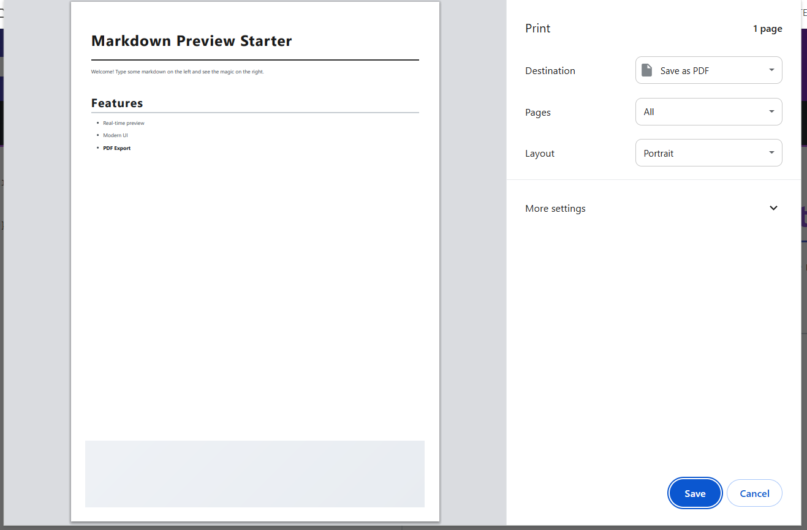

# Markdown Previewer

A simple and efficient React-based web application that allows users to write Markdown text and see the rendered HTML preview in real-time.

## Features

- **Live Preview**: See changes instantly as you type.
- **GitHub Flavored Markdown**: Supports standard GFM syntax including tables, task lists, and code blocks.
- **Responsive Design**: Works on desktop and mobile browsers.
- **Syntax Highlighting**: Built-in support for code snippets.

## Screenshots

| Main Interface | Editor View & Rendered Output |
| :---: | :---: |
|  |  |

## Getting Started

### Prerequisites

- Node.js (v14 or higher)
- npm or yarn

### Installation

1. Clone the repository:
   ```bash
   git clone https://github.com/aadhar41/react-markdown-previewer.git
   ```

2. Navigate to the project directory:
   ```bash
   cd react-markdown-previewer
   ```

3. Install dependencies:
   ```bash
   npm install
   ```

4. Start the development server:
   ```bash
   npm start
   ```

The application will be available at `http://localhost:3000`.

## Project Structure

```text
markdown-preview/
├── public/
│   └── screens/         # Application screenshots
├── src/
│   ├── components/      # React components
│   ├── App.js           # Main application logic
│   └── index.js         # Entry point
└── README.md
```

## Contributing

Contributions are welcome! Please read [CONTRIBUTING.md](CONTRIBUTING.md) for more details.

## License

Distributed under the MIT License. See `LICENSE` for more information.

## Author

**Aadhar Gaur**

- **GitHub**: [@aadhar41](https://github.com/aadhar41)
- **LinkedIn**: [aadhar-gaur-php](https://linkedin.com/in/aadhar-gaur-php)

## Acknowledgments

- [React Markdown](https://github.com/remarkjs/react-markdown) for the core rendering logic.
- Built with ❤️ by Aadhar Gaur.
